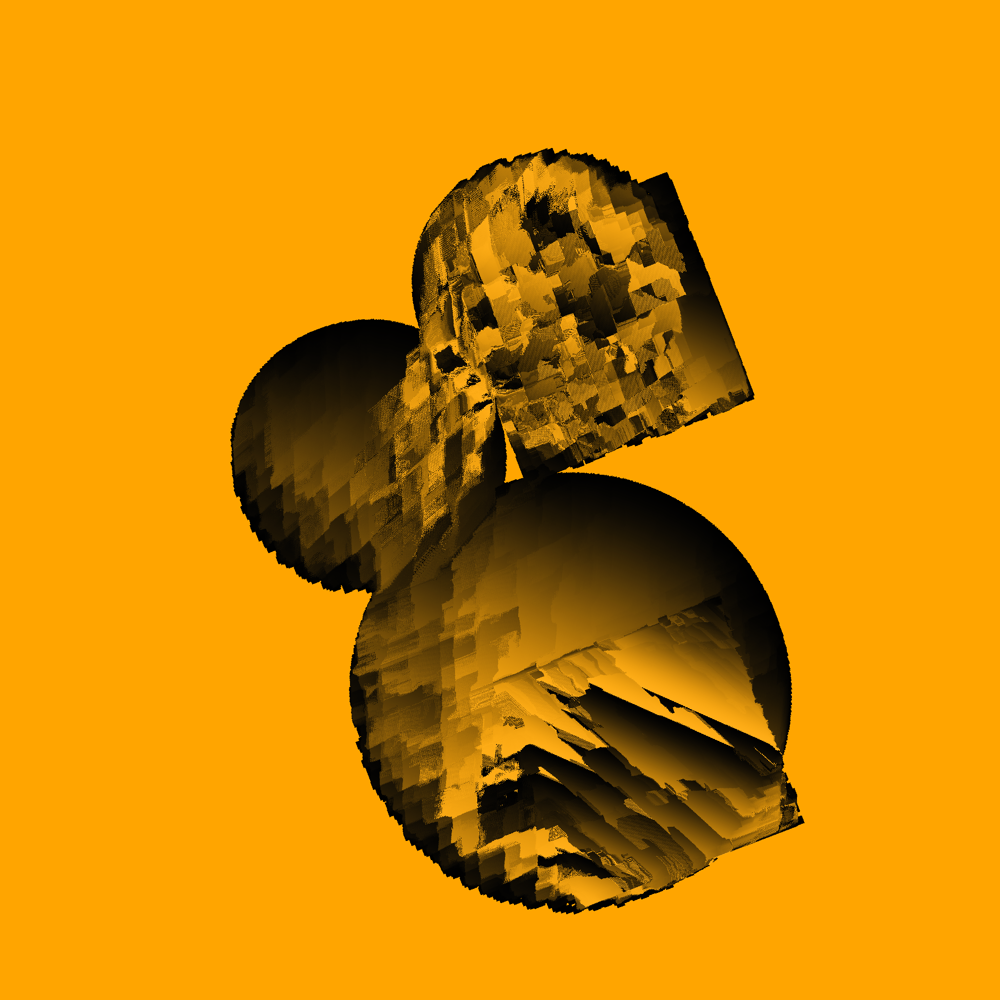
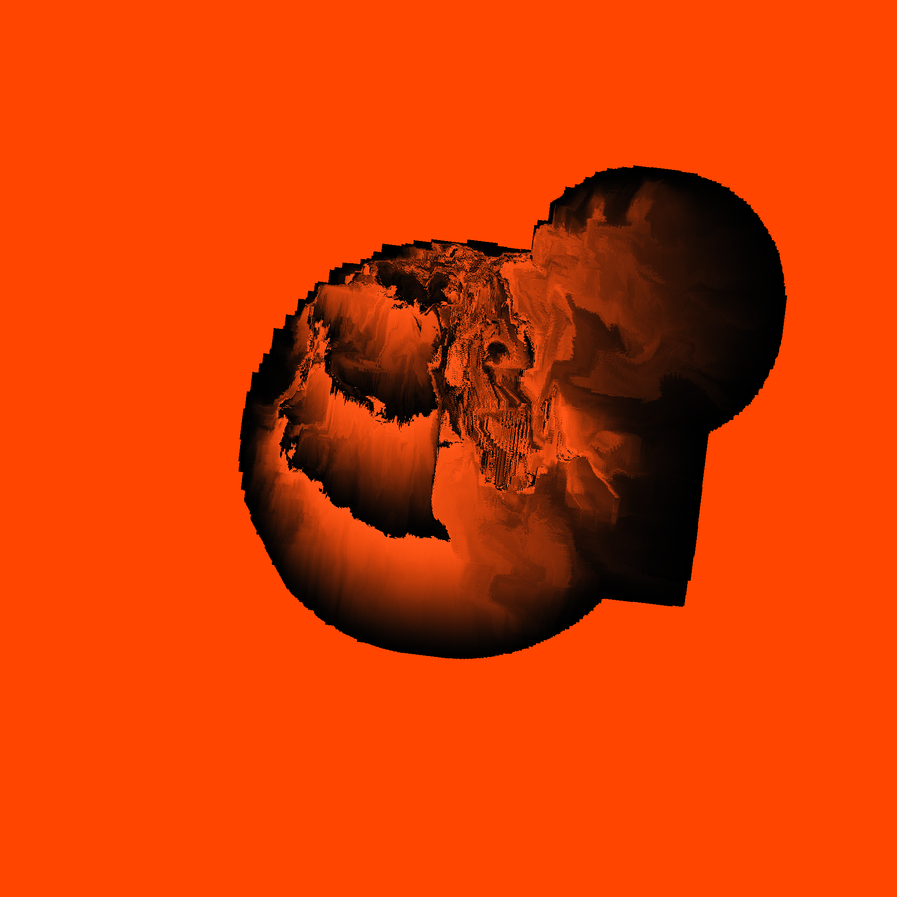

# Creations on fxhash.xyz

__#generativeart__ __#nft__ __#fxhash__ __#tezos__ __#creativecoding__

## Moving Blocks Mono

Real-time deterministic animation based webgl2, fixed size, 2022

__soon on fxhash__

### About

Moving blocks formed by moving blocks.

How does it work?

Several shapes form boundaries. Within these boundaries, the moving blocks move pixels and rotate their color values from a specific color to black.
Each shape has its own direction vector, which affects the feature-based directions and speed of the moving blocks.

Available features:

- 109 colors: one from a unified color list (based on W3C SVG 1.0 color keyword names)
- 3, 5 or 7 shapes: 3 different sizes and 2 types (quads and circles)
- 1 - 3 clusters: shapes are assigned round-robin
- 10 rotation angles: from -168° to 168
- 5 grid sizes: based on Fibonacci numbers, starting with 377, block size is always 21
- Movable blocks: based on grid size (one Fibonacci number before)
- 127 directions of movement: based on 8 basic directions (up, up, left, left-up, left-down, right, right-up, right-down), limited to the 3, 4, 8
  long combinations
- 2 behavior modes for movement distance: negative = decreasing and limited by range or shape, positive = increasing and limited by shape

Animation and feature selection are based on deterministic prng XorShift128 seeded with the fxhash. This allows repeated playback in the same order.

The size is fixed at 1980x1980 pixels.

The preview images are taken after 900 frames.

The animation will stop automatically at 900 frames. Press spacebar, click mouse or touch to change pausing.

Press `h` to see all options.

### Third Party Licenses

- based on [fxhash-boilerplate-webpack](https://github.com/fxhash/fxhash-webpack-boilerplate)
- [@fontsource/vt323](https://www.npmjs.com/package/@fontsource/vt323) ([font source](https://github.com/phoikoi/VT323))
- [@thi.ng/geom-isec](https://www.npmjs.com/package/@thi.ng/geom-isec)
- [@thi.ng/random](https://www.npmjs.com/package/@thi.ng/random)
- [@thi.ng/random-fxhash](https://www.npmjs.com/package/@thi.ng/random-fxhash)
- [twgl.js](https://www.npmjs.com/package/twgl.js)

## Zebra

Real-time deterministic animation based on vanilla js & canvas 2d rendering context, variable size, 2022

Grab it @ https://www.fxhash.xyz/generative/slug/zebra

### About

Zebra follows a simple idea: create an endless variation of new images by simply moving pixels up, down, right or left and rotating colors
according to different rules. Sometimes it's gone too fast, other times it's really slow and hardly changes, sometimes it's quite boring,
then it's surprising, then it's chaotic with glitches and suddenly it's simple and clear again and then it's displaced by the next one.

The animation is based on a deterministic prng. Width, height and pixel ratio change the order of the animation.

A touch/mouse click triggers the butterfly wing effect, which may have an influence on the animation.

Since it uses the canvas 2D renderings context, there is an auto-adjustment for the pixel ratio to keep the performance e.g. at fullscreen
even on larger monitors.

If you are curious you may press `h` for help and play around with the features like adjusting the frame rate, changing the pixel ratio or
simply looking at the behind the scene numbers.

Building Zebra and playing around with it was super fun and I learned a lot.

I hope you enjoy it, too.

Btw: there might be some specials like gold and rainbow.

### Third Party Licenses

- based on [fxhash-boilerplate-webpack](https://github.com/fxhash/fxhash-webpack-boilerplate)
- [@fontsource/vt323](https://www.npmjs.com/package/@fontsource/vt323) ([font source](https://github.com/phoikoi/VT323))
- [prando](https://www.npmjs.com/package/prando)

## License

© 2022 Dirk Adler