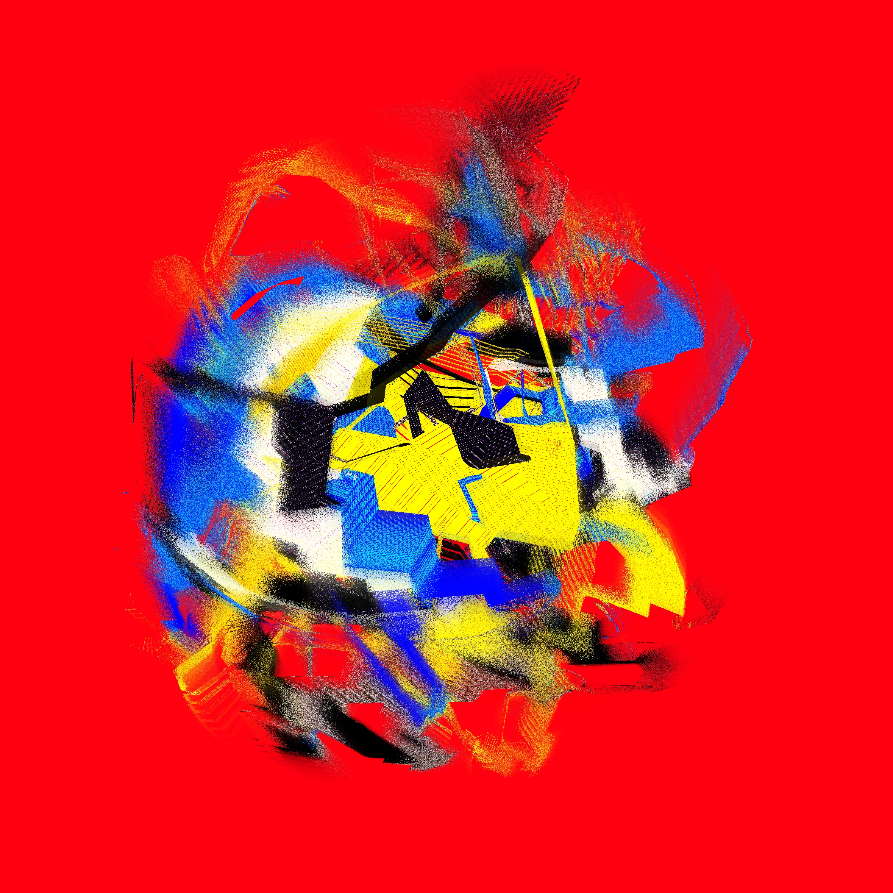

# Creations on fxhash.xyz

__#generativeart__ __#nft__ __#fxhash__ __#tezos__ __#creativecoding__

## Driften

Real-time deterministic animation based webgl2, variable size, 2022

Coming soon to https://www.fxhash.xyz/

### About

This piece evolved from the basic idea of having a simple animated, colorful, circular thing, like a colorful version of Moving
Blocks Mono crossed with Zebra. As so often happens, ideas evolve, new ideas emerge, intersect with old ones, and things drift in other
directions through beautiful pixel landscapes. And here we are - in Driften - and - once again - it's all about moving pixels and shifting
colors.

Driften, by the way, is German for drifting.

How does it work?

The animation is based on several layers.

The first layer uses psrdnoise combined with feedback with the last layer. This layer mainly determines
in which areas the colors should be shifted, which color should be reset (which depends on the color shifting
direction) and where and how pixels should be shifted and if the brush is applied. It also creates the moiré effects.

The second layer contains a simple variant of moving blocks, which are applied as brush strokes in the last layer.

The last layer uses a double buffer to store its state, allowing color and pixel shifts.

Features:

- Color
- Color shift direction [-1, 1] (backward, forward)
- Color shift speed [1, 2, 4] (slow, medium, fast)
- Brush moving blocks - number [100, 200, 1000] & size [0.1, 0.05, 0.01] (few large, some medium, many small)
- Brush moving directions - 28 pairs of up, left-up, left, left-down, down, right-down, right, right-up.
- Brush intensity [0.1, 1.0, 3.0] (low, medium, high)
- Moiré intensity [0.1, 1.0, 10.0] (fine, coarse, very coarse)
- Motion Speed [1, 3, 7] (slow, medium, fast)
- Gradient levels [1, 2, 6] (mono, duo, hexa)
- Gradient colors

Gradients consist of the base color and, depending on the steps, 1 (mono), 2 (duo) or 6 (hexa) additional colors. They are built from a
combination of low/high chroma and low/high lightness colors. Hexa gradients actually consist of 2 gradients, similar
to duo gradients, but with more intermediate steps along the hue.

Animation and feature selection are based on the deterministic prng Xoshiro128 seeded with the fxhash. This allows repeated playback in the
same sequence. The animation is synchronized with frames and not with time.

The preview images are taken after 400 frames.

The animation is automatically paused at 400 frames. Press spacebar, click mouse or touch to change pause.

Press `c` to take a picture. Press `f` for full screen mode. Press `h` to see all options.

Available query string parameters:

- autopause - disables automatic pausing
- pixelratio=2 - sets the pixel ratio (default: 2)
- showannouncement - activates the announcement
- cyclegradientspeed=3 - activates gradient playback and sets the speed factor
- speed - sets the overall speed factor (experimental)
- kioskspeed=10 - activates the kiosk mode and sets the speed in seconds
- showinfo - activates the info box

### Third Party Licenses

- based on [fxhash-boilerplate-webpack](https://github.com/fxhash/fxhash-webpack-boilerplate)
- [@fontsource/vt323](https://www.npmjs.com/package/@fontsource/vt323) ([font source](https://github.com/phoikoi/VT323))
- [@thi.ng/color](https://www.npmjs.com/package/@thi.ng/color)
- [@thi.ng/geom-isec](https://www.npmjs.com/package/@thi.ng/geom-isec)
- [@thi.ng/math](https://www.npmjs.com/package/@thi.ng/math)
- [@thi.ng/random](https://www.npmjs.com/package/@thi.ng/random)
- [@thi.ng/random-fxhash](https://www.npmjs.com/package/@thi.ng/random-fxhash)
- [psrdnoise2.glsl](https://github.com/stegu/psrdnoise)
- [twgl.js](https://www.npmjs.com/package/twgl.js)

## License

© 2022 Dirk Adler