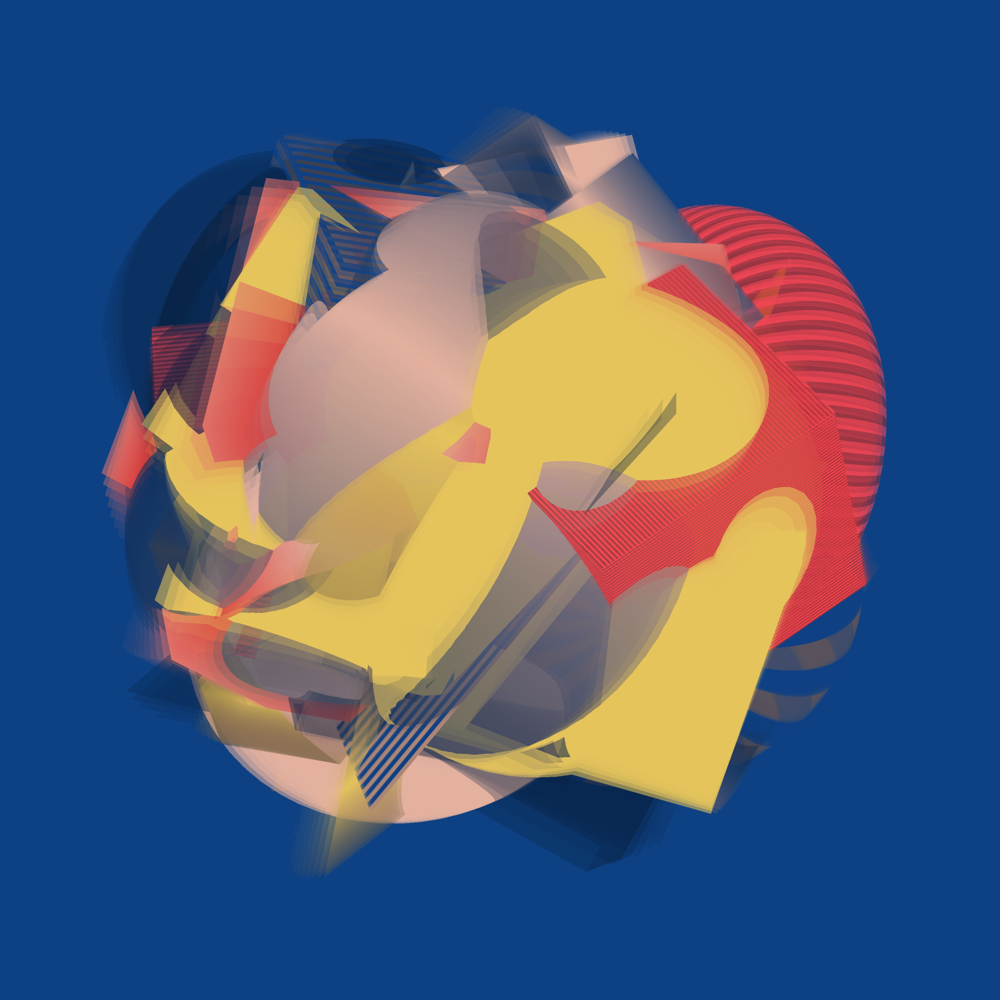

# Creations on fxhash.xyz

See [my profile on fxhash.xyz](https://www.fxhash.xyz/u/dirx/creations).

__#generativeart__ __#nft__ __#fxhash__ __#tezos__ __#creativecoding__

## Alea

Real-time deterministic animation based webgl2, fixed size, 2022

Grab it @ https://www.fxhash.xyz/generative/slug/alea

### About

Roll the dice with shapes and capture the moment!
Alea, by the way, is Latin and means dice / gambling.

How does it work?

Each Alea consists of 64 objects randomly arranged around a center and randomly differing in shape, texture, and movement. A curated 5
colors palette is picked and used for the textures. The colors are first sorted by saturation to select a reference color. With this, the
colors are then sorted again by luminance.

The animation itself is 32 frames long and stops abruptly. It consists of 3 layers. The first layer moves the objects around the center
and draws the animated objects. The second uses the first layer and a double buffer to capture the motion blur based on a depth mask. The
third is mainly for screen rendering, debugging and behind-the-scene looks.

Features:

- shapes [7] (toruses, cubes, planes, toruses & cubes, toruses & planes, cubes & planes, toruses, cubes & planes)
- palette [58] (based on German Max Magazine covers 1991 - 1995)
- color sort direction [2] (up, down) - sort by saturation
- color sort reference [3] (0, 1, 2) - used for sorting by luminance / background color

Animation and feature selection are based on the deterministic prng Xoshiro128 seeded with the fxhash. This allows repeated playback in the
same sequence. The animation is synchronized with frames and not with time.

The preview images are taken after 32 frames.

Shortcuts & interactions:

- spacebar to trigger a rotation animation (or single click / tap)
- `o` to trigger random object change animation followed by a rotation animation (or double click / tap)
- `r` to trigger a random feature change followed by a random object change and rotation animation (or triple click / tap)
- `k` to toggle this kiosk mode (off, 3, 5 or 10 secs)
- `c` to capture an image
- `f` for full screen mode
- `h` to see all options

Available query string parameters:

- size=8000 - sets the base size for width/height to 8000px (default 3000, useful if you want to capture bigger pngs)
- showannouncement - activates the announcement
- kioskspeed=5 - activates the kiosk mode and sets the speed in seconds
- showinfo - activates the info box

### Source Code

See https://github.com/dirx/fxhash-creations/tree/alea

### Third Party Licenses

- based on [fxhash-boilerplate-webpack](https://github.com/fxhash/fxhash-webpack-boilerplate)
- [@fontsource/vt323](https://www.npmjs.com/package/@fontsource/vt323) ([font source](https://github.com/phoikoi/VT323))
- [@fontsource/outfit](https://www.npmjs.com/package/@fontsource/outfit) ([font source](https://github.com/Outfitio/Outfit-Fonts/))
- [@thi.ng/color](https://www.npmjs.com/package/@thi.ng/color)
- [@thi.ng/math](https://www.npmjs.com/package/@thi.ng/math)
- [@thi.ng/random](https://www.npmjs.com/package/@thi.ng/random)
- [@thi.ng/random-fxhash](https://www.npmjs.com/package/@thi.ng/random-fxhash)
- [twgl.js](https://www.npmjs.com/package/twgl.js)

## Fischbach

Real-time deterministic animation based webgl2, variable size, 2022

Grab it @ https://www.fxhash.xyz/generative/slug/fischbach

### About

#fxhashturnsone

The first 365 crazy days of fxhash - time to celebrate this and take a look back.

The entropy of memories in a vivid photo collage that gives me goosebumps while others might just see moving eye candy.
Perspective and perception can be so different.

Based on some of my photos from the last 365 days that trigger emotional memories, even if they are not directly connected.
By the way, Fischbach is the name of the small village where I grew up. It was a great time!

How does it work?

Each piece uses pairs of photos and colors (top/bottom).

The animated collage itself is based on two layers. The first layer uses a double buffer to cut, colorize and animate the photos.
The second layer is mainly just for screen rendering, debugging and behind-the-scene looks.

Cutting and pasting photos is based on a variable moving color grid, the fixed horizon, the variable position of the photos top/bottom, the
previous buffer and some *magic* distance calculations between them.

The grid itself is a combination of vertical color stripes with variable position and distance factors that determine the color gradient
between the two colors, and folds that alternate between the two colors depending on the horizontal and vertical values.

Especially the entropy of the photos and the colored grid influence the pixel movement.

Animation changes are triggered after a random number of frames and effect folds, stripes and photo position.
These replace parts of the current collage (fade to black) or add some (discard fragment updates).

Features:

- top color [12] - hue, colorful & bright
- bottom color [6] - hue, less colorful & bright
- top photo [16] (zingst, birds, xmas, zustand, zebra, moving-blocks-mono, fischbach, santanyi, goldblume, ♠4, driften, brand-pyramide,
  zäpfle, bc, tisa, lieblingspulli)
- bottom photo: [16] (zingst, birds, xmas, zustand, zebra, moving-blocks-mono, fischbach, santanyi, goldblume, ♠4, driften, brand-pyramide,
  zäpfle, bc, tisa, lieblingspulli)
- horizon [0.618, 0.5, 0.382] (down, center, up)
- hectic [3, 5, 11] (calm, slightly, very)
- horizontal folds [113, 365, 997, 2153, 3987] - used for first animation iteration, variable
- vertical folds [7, 37, 127, 571, 1501, 3147] - used for first animation iteration, variable
- min stripes [1, 3, 5] - used for first animation iteration, variable

Animation and feature selection are based on the deterministic prng Xoshiro128 seeded with the fxhash. This allows repeated playback in the
same sequence. The animation is synchronized with frames and not with time.

The preview images are taken after 300 frames.

Shortcuts & interactions:

- spacebar, mouse click or tap touch to trigger animation changes
- `c` to take a picture
- `f` for full screen mode
- `p` to pause
- `h` to see all options

Available query string parameters:

- autopause - enable automatic pausing
- pixelratio=2 - sets the pixel ratio (default: device)
- showannouncement - activates the announcement
- kioskspeed=10 - activates the kiosk mode and sets the speed in seconds
- showinfo - activates the info box

### Source Code

See https://github.com/dirx/fxhash-creations/tree/fischbach

### Third Party Licenses

- based on [fxhash-boilerplate-webpack](https://github.com/fxhash/fxhash-webpack-boilerplate)
- [@fontsource/vt323](https://www.npmjs.com/package/@fontsource/vt323) ([font source](https://github.com/phoikoi/VT323))
- [@thi.ng/color](https://www.npmjs.com/package/@thi.ng/color)
- [@thi.ng/math](https://www.npmjs.com/package/@thi.ng/math)
- [@thi.ng/random](https://www.npmjs.com/package/@thi.ng/random)
- [@thi.ng/random-fxhash](https://www.npmjs.com/package/@thi.ng/random-fxhash)
- [twgl.js](https://www.npmjs.com/package/twgl.js)

## Driften

Real-time deterministic animation based webgl2, variable size, 2022

Grab it @ https://www.fxhash.xyz/generative/slug/driften

### About

This piece evolved from the basic idea of having a simple animated, colorful, circular thing, like a colorful version of Moving
Blocks Mono crossed with Zebra. As so often happens, ideas evolve, new ideas emerge, intersect with old ones, and things drift in other
directions through beautiful pixel landscapes. And here we are - in Driften - and - once again - it's all about moving pixels and shifting
colors.

Driften, by the way, is German for drifting.

How does it work?

The animation is based on several layers.

The first layer uses psrdnoise combined with feedback with the last layer. This layer mainly determines
in which areas the colors should be shifted, which color should be reset (which depends on the color shifting
direction) and where and how pixels should be shifted and if the brush is applied. It also creates the moiré effects.

The second layer contains a simple variant of moving blocks, which are applied as brush strokes in the last layer.

The last layer uses a double buffer to store its state, allowing color and pixel shifts.

Features:

- Color
- Color shift direction [-1, 1] (backward, forward)
- Color shift speed [1, 2, 4] (slow, medium, fast)
- Brush moving blocks - number [100, 200, 1000] & size [0.1, 0.05, 0.01] (few large, some medium, many small)
- Brush moving directions - 28 pairs of up, left-up, left, left-down, down, right-down, right, right-up.
- Brush intensity [0.1, 1.0, 3.0] (low, medium, high)
- Moiré intensity [0.1, 1.0, 10.0] (fine, coarse, very coarse)
- Moving Speed [1, 3, 7] (slow, medium, fast)
- Gradient levels [1, 2, 6] (mono, duo, hexa)
- Gradient colors

Gradients consist of the base color and, depending on the steps, 1 (mono), 2 (duo) or 6 (hexa) additional colors. They are built from a
combination of low/high chroma and low/high lightness colors. Hexa gradients actually consist of 2 gradients, similar
to duo gradients, but with more intermediate steps along the hue.

Animation and feature selection are based on the deterministic prng Xoshiro128 seeded with the fxhash. This allows repeated playback in the
same sequence. The animation is synchronized with frames and not with time.

The preview images are taken after 400 frames.

The animation is automatically paused at 400 frames. Press spacebar, click mouse or touch to change pause.

Press `c` to take a picture. Press `f` for full screen mode. Press `h` to see all options.

Available query string parameters:

- autopause - disables automatic pausing
- pixelratio=2 - sets the pixel ratio (default: 2)
- showannouncement - activates the announcement
- cyclegradientspeed=3 - activates gradient playback and sets the speed factor
- speed=1 - sets the overall speed factor (experimental, default: 1)
- kioskspeed=10 - activates the kiosk mode and sets the speed in seconds
- showinfo - activates the info box

### Source Code

See https://github.com/dirx/fxhash-creations/tree/driften

### Third Party Licenses

- based on [fxhash-boilerplate-webpack](https://github.com/fxhash/fxhash-webpack-boilerplate)
- [@fontsource/vt323](https://www.npmjs.com/package/@fontsource/vt323) ([font source](https://github.com/phoikoi/VT323))
- [@thi.ng/color](https://www.npmjs.com/package/@thi.ng/color)
- [@thi.ng/geom-isec](https://www.npmjs.com/package/@thi.ng/geom-isec)
- [@thi.ng/math](https://www.npmjs.com/package/@thi.ng/math)
- [@thi.ng/random](https://www.npmjs.com/package/@thi.ng/random)
- [@thi.ng/random-fxhash](https://www.npmjs.com/package/@thi.ng/random-fxhash)
- [psrdnoise2.glsl](https://github.com/stegu/psrdnoise)
- [twgl.js](https://www.npmjs.com/package/twgl.js)

## Moving Blocks Mono

Real-time deterministic animation based webgl2, fixed size, 2022

Grab it @ https://www.fxhash.xyz/generative/slug/moving-blocks-mono

### About

Moving blocks formed by moving blocks.

How does it work?

Several shapes form boundaries. Within these boundaries, the moving blocks move pixels and rotate their color values from a specific color
to black.
Each shape has its own direction vector, which affects the feature-based directions and speed of the moving blocks.

Features:

- 109 colors: one from a unified color list (based on W3C SVG 1.0 color keyword names)
- 3, 5 or 7 shapes: 3 different sizes and 2 types (quads and circles)
- 1 - 3 clusters: shapes are assigned round-robin
- 10 rotation angles: from -168° to 168
- 5 grid sizes: based on Fibonacci numbers, starting with 377, block size is always 21
- Movable blocks: based on grid size (one Fibonacci number before)
- 127 directions of movement: based on 8 basic directions (up, up, left, left-up, left-down, right, right-up, right-down), limited to the 3,
  4, 8
  long combinations
- 2 behavior modes for movement distance: negative = decreasing and limited by range or shape, positive = increasing and limited by shape

Animation and feature selection are based on the deterministic prng XorShift128 seeded with the fxhash. This allows repeated playback in the
same order.

The size is fixed at 1980x1980 pixels.

The preview images are taken after 900 frames.

The animation will stop automatically at 900 frames. Press spacebar, click mouse or touch to change pausing. You can add `autopause` as
query string parameter to disable automatic pausing.

Press `c` to capture an image. Press `f` for fullscreen. Press `h` to see all options.

### Source Code

See https://github.com/dirx/fxhash-creations/tree/mono

### Third Party Licenses

- based on [fxhash-boilerplate-webpack](https://github.com/fxhash/fxhash-webpack-boilerplate)
- [@fontsource/vt323](https://www.npmjs.com/package/@fontsource/vt323) ([font source](https://github.com/phoikoi/VT323))
- [@thi.ng/geom-isec](https://www.npmjs.com/package/@thi.ng/geom-isec)
- [@thi.ng/random](https://www.npmjs.com/package/@thi.ng/random)
- [@thi.ng/random-fxhash](https://www.npmjs.com/package/@thi.ng/random-fxhash)
- [twgl.js](https://www.npmjs.com/package/twgl.js)

## Zebra

Real-time deterministic animation based on vanilla js & canvas 2d rendering context, variable size, 2022

Grab it @ https://www.fxhash.xyz/generative/slug/zebra

### About

Zebra follows a simple idea: create an endless variation of new images by simply moving pixels up, down, right or left and rotating colors
according to different rules. Sometimes it's gone too fast, other times it's really slow and hardly changes, sometimes it's quite boring,
then it's surprising, then it's chaotic with glitches and suddenly it's simple and clear again and then it's displaced by the next one.

The animation is based on a deterministic prng. Width, height and pixel ratio change the order of the animation.

A touch/mouse click triggers the butterfly wing effect, which may have an influence on the animation.

Since it uses the canvas 2D renderings context, there is an auto-adjustment for the pixel ratio to keep the performance e.g. at fullscreen
even on larger monitors.

If you are curious you may press `h` for help and play around with the features like adjusting the frame rate, changing the pixel ratio or
simply looking at the behind the scene numbers.

Building Zebra and playing around with it was super fun and I learned a lot.

I hope you enjoy it, too.

Btw: there might be some specials like gold and rainbow.

### Source Code

See https://github.com/dirx/fxhash-creations/tree/zebra

### Third Party Licenses

- based on [fxhash-boilerplate-webpack](https://github.com/fxhash/fxhash-webpack-boilerplate)
- [@fontsource/vt323](https://www.npmjs.com/package/@fontsource/vt323) ([font source](https://github.com/phoikoi/VT323))
- [prando](https://www.npmjs.com/package/prando)

## License

© 2022 Dirk Adler
