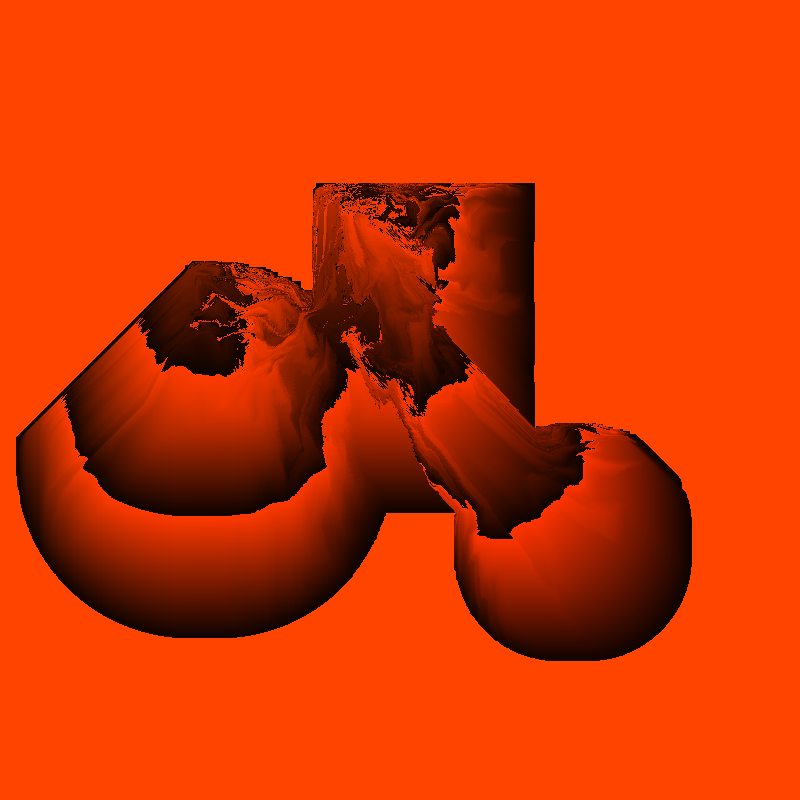

# Zebra / fxhash.xyz

Real-time deterministic animation based on vanilla js & canvas 2d rendering context, variable size, 2022

__#generativeart__ __#nft__ __#fxhash__ __#tezos__ __#creativecoding__

## Edition: Moving Blocks

__soon on fxhash__

Moving blocks formed by moving blocks.

How does it work?

Several shapes form a boundary. Within these boundaries, blocks are allowed to move pixels and rotate color values according to various principles.

The fascinating patterns that emerge are shaped by various features of the animation, such as the direction of movement, the size of the grid, 
the number and size of the moving blocks, and the color. The exciting thing is that the given boundaries in turn influence the animation itself.

The animation is based on the deterministic prng sfc32 that is also used by fxhash. This allows it to be played repeatedly in the same sequence. 
Width, height and pixel ratio change the sequence of the animation.

Since it uses the canvas 2D rendering context, there is an automatic adjustment for the pixel ratio to keep the performance even at full screen on larger monitors.

If you are curious, you can press `h` to get help and play around with the features like changing the pixel ratio or just look at some numbers behind the scene.

### Third Party Licenses

- based on [fxhash-boilerplate-webpack](https://github.com/fxhash/fxhash-webpack-boilerplate)
- [@fontsource/vt323](https://www.npmjs.com/package/@fontsource/vt323) ([font source](https://github.com/phoikoi/VT323))
- [@thi.ng/random-fxhash](https://www.npmjs.com/package/@thi.ng/random-fxhash)
- [@thi.ng/geom-isec](https://www.npmjs.com/package/@thi.ng/geom-isec)
- [@thi.ng/math](https://www.npmjs.com/package/@thi.ng/math)

## Edition: Zebra

Grab it @ https://www.fxhash.xyz/generative/slug/zebra

Zebra follows a simple idea: create an endless variation of new images by simply moving pixels up, down, right or left and rotating colors according to different rules. Sometimes it's gone too fast, other times it's really slow and hardly changes, sometimes it's quite boring, then it's surprising, then it's chaotic with glitches and suddenly it's simple and clear again and then it's displaced by the next one.

The animation is based on a deterministic prng. Width, height and pixel ratio change the order of the animation.

A touch/mouse click triggers the butterfly wing effect, which may have an influence on the animation.

Since it uses the canvas 2D renderings context, there is an auto-adjustment for the pixel ratio to keep the performance e.g. at fullscreen even on larger monitors.

If you are curious you may press `h` for help and play around with the features like adjusting the frame rate, changing the pixel ratio or simply looking at the behind the scene numbers.

Building Zebra and playing around with it was super fun and I learned a lot.

I hope you enjoy it, too.

Btw: there might be some specials like gold and rainbow.

### Third Party Licenses

- based on [fxhash-boilerplate-webpack](https://github.com/fxhash/fxhash-webpack-boilerplate)
- [@fontsource/vt323](https://www.npmjs.com/package/@fontsource/vt323) ([font source](https://github.com/phoikoi/VT323))
- [prando](https://www.npmjs.com/package/prando)

## License

© 2022 Dirk Adler