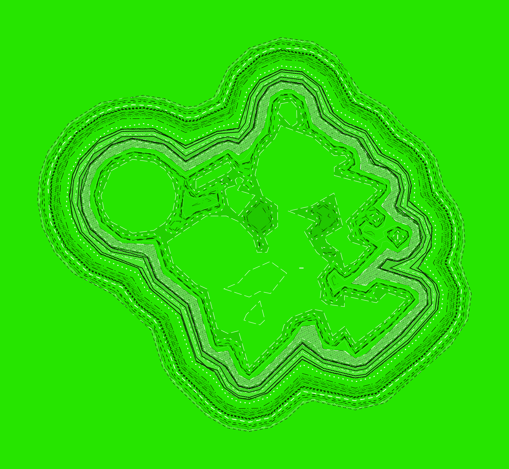

# Creations on fxhash.xyz

__#generativeart__ __#nft__ __#fxhash__ __#tezos__ __#ethereum__ __#creativecoding__

## Still C

Real-time deterministic svg image, flexible size, 2025

Grab it @ https://www.fxhash.xyz/generative/slug/still-c

### About

Just a big dot with a lot of little dots inside.

This piece arranges shapes with varied fill patterns and outlines, leveraging transformer and traversal algorithms while responding to an underlying flow field system.

Features:

- dotSize (2-7) - base size of each shape
- gridSize (98-175, step: 7) - grid resolution
- palettes (1-4) - number of random 4-color palettes
- attractors (21-175, step: 7) - flow field influence points
- attractorStrength - attractor influence function (linear, sine, sineSquared, easeIn, smoothstep, parabola, sigmoid)
- x - horizontal coordinate transformation function (linear, sine, sineSquared, easeIn, smoothstep, parabola, sigmoid)
- y - vertical coordinate transformation function (linear, sine, sineSquared, easeIn, smoothstep, parabola, sigmoid)
- distributor - point distribution algorithm (fermatsSpiral, fibonacciLattice, sphericalSpiral, geodesicSphere)
- traverser - traversal algorithm (row, column, zigZagRow, zigZagColumn, diagonal, bfs, dfs, random)
- kick - position/color adjustment function (linear, sine, sineSquared, easeIn, smoothstep, parabola, sigmoid)
- repeat (1-25) - color pattern frequency
- fills - shape fill strategy (more or less of palette colors, light, dark or no fill)
- strokes - shape outline strategy (more or less of palette colors, light, dark or no outline)
- shape - quad, hexagon or circle

Shortcuts & interactions:

- `h` to toggle help
- `p` to download as png
- `s` to download as svg

### Third Party Licenses

- [@fxhash/project-sdk](https://github.com/fxhash/fxhash-package)
- [@thi.ng/color](https://github.com/thi-ng/umbrella/tree/develop/packages/color)
- [@thi.ng/dl-asset](https://github.com/thi-ng/umbrella/tree/develop/packages/dl-asset)
- [@thi.ng/geom](https://github.com/thi-ng/umbrella/tree/develop/packages/geom)
- [@thi.ng/math](https://github.com/thi-ng/umbrella/tree/develop/packages/math)
- [@thi.ng/random-fxhash](https://github.com/thi-ng/umbrella/tree/develop/packages/random-fxhash)
- [@thi.ng/transducers](https://github.com/thi-ng/umbrella/tree/develop/packages/transducers)
- [@thi.ng/vectors](https://github.com/thi-ng/umbrella/tree/develop/packages/vectors)

## License

© 2025 Dirk Adler
