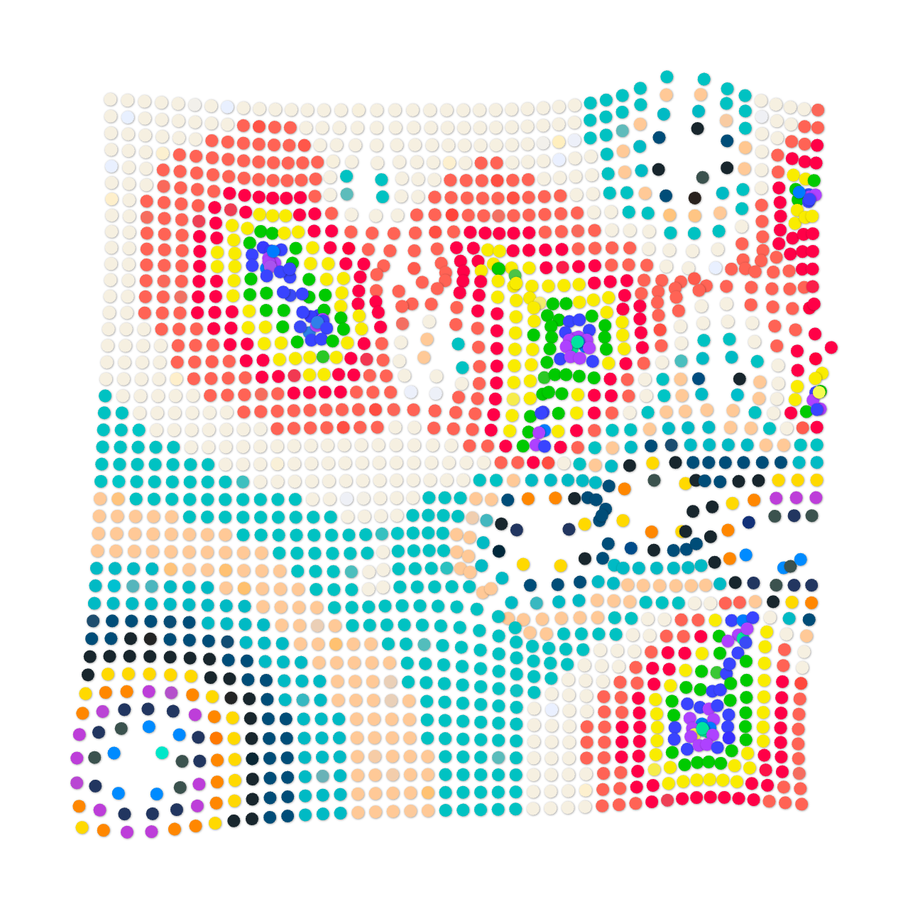

# Creations on fxhash.xyz

__#generativeart__ __#nft__ __#fxhash__ __#tezos__ __#ethereum__ __#creativecoding__

## Still B

Real-time deterministic svg image, flexible size, 2025

Grab it @ https://www.fxhash.xyz/generative/slug/still-b

### About

A rippled SDF composed of rotated shapes, duplicated into layered contours with black / white and marker colored and dashed strokes and pattern fills, and rendered as polygons in an SVG.

Features:

- contours (32 - 64, step: 4) - number of shape contours
- rects (4 - 64) - number of rectangles
- circles (0 - (64 - rects)) - number of circles
- triangles (remaining from 64) - number of triangles
- gap (0 - 5) - extra shape gap
- angle (-90 - 90, step: 15) - shape rotation angle
- resX (256 - 1024, step: power of 2) - horizontal resolution
- resY (256 - 1024, step: power of 2) - vertical resolution
- background (0 - 246) - background color
- marker (0 - 246) - marker color

Shortcuts & interactions:

- `h` to toggle help
- `p` to download as png
- `s` to download as svg

### Third Party Licenses

- [@fxhash/project-sdk](https://github.com/fxhash/fxhash-package)
- [@thi.ng/color](https://github.com/thi-ng/umbrella/tree/develop/packages/color)
- [@thi.ng/dl-asset](https://github.com/thi-ng/umbrella/tree/develop/packages/dl-asset)
- [@thi.ng/geom](https://github.com/thi-ng/umbrella/tree/develop/packages/geom)
- [@thi.ng/geom-sdf](https://github.com/thi-ng/umbrella/tree/develop/packages/geom-sdf)
- [@thi.ng/math](https://github.com/thi-ng/umbrella/tree/develop/packages/math)
- [@thi.ng/matrices](https://github.com/thi-ng/umbrella/tree/develop/packages/matrices)
- [@thi.ng/random-fxhash](https://github.com/thi-ng/umbrella/tree/develop/packages/random-fxhash)
- [@thi.ng/transducers](https://github.com/thi-ng/umbrella/tree/develop/packages/transducers)

## License

© 2025 Dirk Adler
